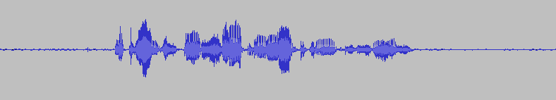
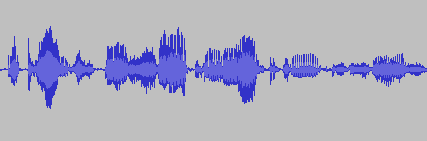
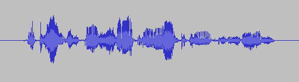

# Leading and trailing silence label for VCTK Corpus (version 0.92)

This repository provides the information about the leading and trailing silences of VCTK corpus. The infomation is obtained by training an ASR model with the corpus and use it to extract alignment, which is more robust approach to non-uniform noise than using signal processing.

This information is useful for preprocessing the VCTK Corpus to remove exessive leading and trailing silence frames with noise. The silence information is only compatiable with version 0.92 of the corpus.

## Original waveform and silence timestamp



*p226_036_mic1.wav*

The leading and trailing silence timestamps can be found in `vctk-silences.0.92.txt`. It includes utterance id, start and end of speech segment in second.
```
p226_036 0.930 3.450
```

## Trim the leading and trailing silences
```bash
sox p226_036_mic1.wav p226_036_mic1.trim.wav trim 0.930 =3.450
```

We could use `sox` to trim the silences as shown by the above example. As it is just timestamp, we can manipulate the clipping region by adjusting it.



*p226_036_mic1.trim.wav*


## Trim then pad with artificial silences
```bash
sox p226_036_mic1.wav p226_036_mic1.trimpad.wav trim 0.930 =3.450 pad 0.25 0.25
```

We can also pad the utterance with a small leading and trailing segment silence as shown by the above example. It might be helpful for training end-to-end TTS model.



*p226_036_mic1.trimpad.wav*

## References
[VCTK Corpus (version 0.92)](https://datashare.is.ed.ac.uk/handle/10283/3443)
